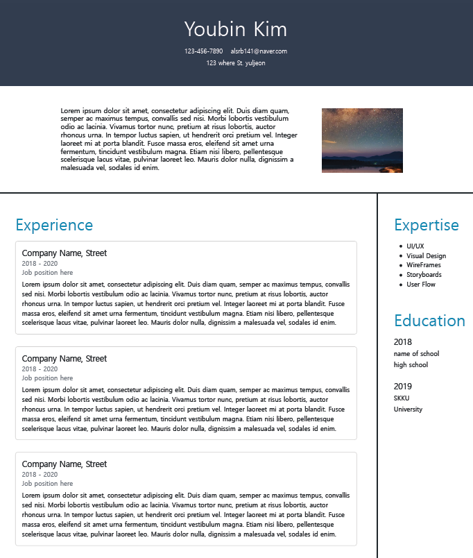

# Ossp_term_project - *REScUe ME*
> ## *Team 29*

  

## Goal
>이력서를 쓰는데 어려움을 겪고 있는 사람들을 위해 이력서에 대한 tip과 관련 영상들을 제공하고 사용자 정보를 입력하여 쉽게 간단하게 이력서를 만들 수 있는 웹페이지를 제공하고자 한다.

## Screenshot
홈페이지  
  
템플릿 선택화면  
  
정보 입력 화면&input validation 예시  
   
템플릿 정보  
    

## Presentation Video
> https://youtu.be/9VI8XmxrinM
## How to visit
> https://youngmin5219.github.io/ossp_team_project/
## How to use
>유저가 처음 index.html 파일로 접속을 하여 홈 화면에 있는 tip 및 유튜브 영상들을 보고 이력서를 쓰는 법에 대해 공부를 할 수 있다.
>
>그 후 상단 nav바에 있는 template을 클릭하면 다양한 template에 대한 미리보기 및 별점을 볼 수 있고 유저가 원하는 template을 선택한다.
>
>유저가 자신의 정보를 입력하면 template에 맞게 해당 정보들을 유저가 선택한 template에 입력하여 쉽고 간편하게 이력서를 작성할 수 있도록 한다.
>정보 입력 시 personal info 파트는 input validation이 적용되어 필수적으로 입력해야 한다.
>또한 name, job은 숫자를 포함할 수 없으며 email과 phone number는 각각의 형식을 지켜서 작성해야 한다.
>
>데이터를 입력한 이후 Save_RESUME 버튼을 클릭해 RESUME를 다운로드 받을 수 있다.

## Example

## Documentation

### index.html
>유저들에게 가장 먼저 보여지는 페이지이다. 상단에는 REScUe ME 로고와 함께 4가지(Home, Template, Video, Tips)의 nav항목을 배치하였다.
>
>nav항목 선택을 통해 원하는 곳으로 이동할 수 있다.
>
>
>로고를 클릭할 경우 페이지를 새로고침한다.
>
>Home 버튼을 클릭할 경우 이 웹페이지에 대한 소개와 목적성이 나타나있는 #main_page로 이동한다.
>
>Template 버튼을 클릭할 경우 template과 관련한 새로운 페이지 star.html로 이동한다.
>
>Video 버튼을 클릭할 경우 resume 작성과 관련한 영상들이 나열된 #video_page로 이동한다.
>
>Tips 버튼을 클릭할 경우 resume 작성에 대한 유명 인사 및 현직자들의 조언이 있는 #tip_page로 이동한다.
>
>
>#video_page에서는 See More Videos >> 버튼을 클릭할 시 더 많은 video를 확인할 수 있으며 Briefly >> 버튼을 통해 다시 간략히 할 수 있다.
>
>#tip_page에서도 See More Tips >> 버튼을 클릭할 시 더 많은 Tip들을 확인할 수 있으며 Briefly >> 버튼을 통해 다시 간략히 할 수 있다.

### star.html
>유저들이 각각의 template에 대해 1~5점의 별점을 부가하여 추후에 다른 유저들이 해당 평가를 바탕으로 어떤 template이 인기가 좋은지 알 수 있도록하여 template 선정에 도움이 되고자 하였다.
>
>템플릿을 선택하면 선택한 템플릿 number가 url을 통해 input.html로 전달된다.

### input.html
>input.html 에서 입력받는 정보들의 id와 각각에 해당하는 내용은 아래와 같다.
>
- name (이름)
- job (직업)
- address (주소)
- email (이메일)
- phone (전화번호)
- summary (간략한 자기소개)
- expertise1~5 (다룰 수 있는 프로그래밍 언어나 기술)
- education_year1~2 (재학기간)
- educaiton_name1~2 (출신 학교명)
- education_garde1~2 (고등학교/대학교/대학원)
- year1~3 (경력 기간/프로젝트 기간)
- experience_name1~3 (경력명/프로젝트명)
- job_position1~3 (역할)
- experience_summary1~3 (경험 요약)

### templates
>input.html에서 정보를 받아와 template에 나타낸다.
>
>상단 좌측에 있는 Save 버튼을 클릭해 RESUME div를 저장한다.

### Code of Conduct
> Adopted Microsoft Open Source Code of Conduct

### License
> MIT License
